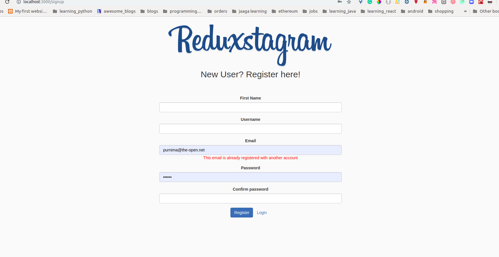
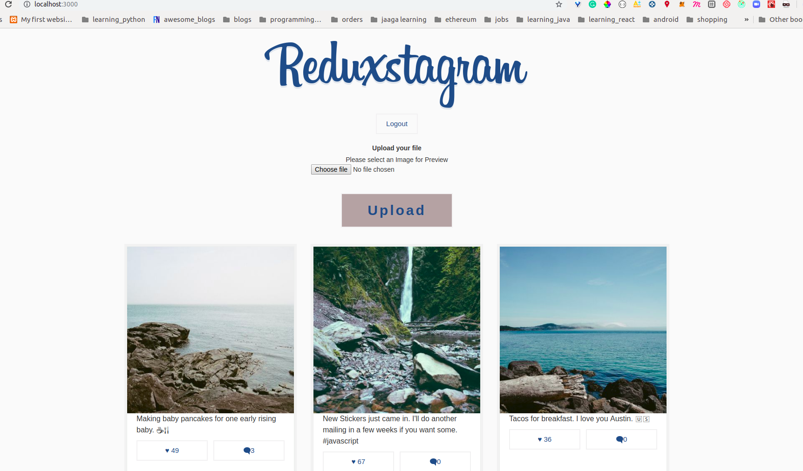
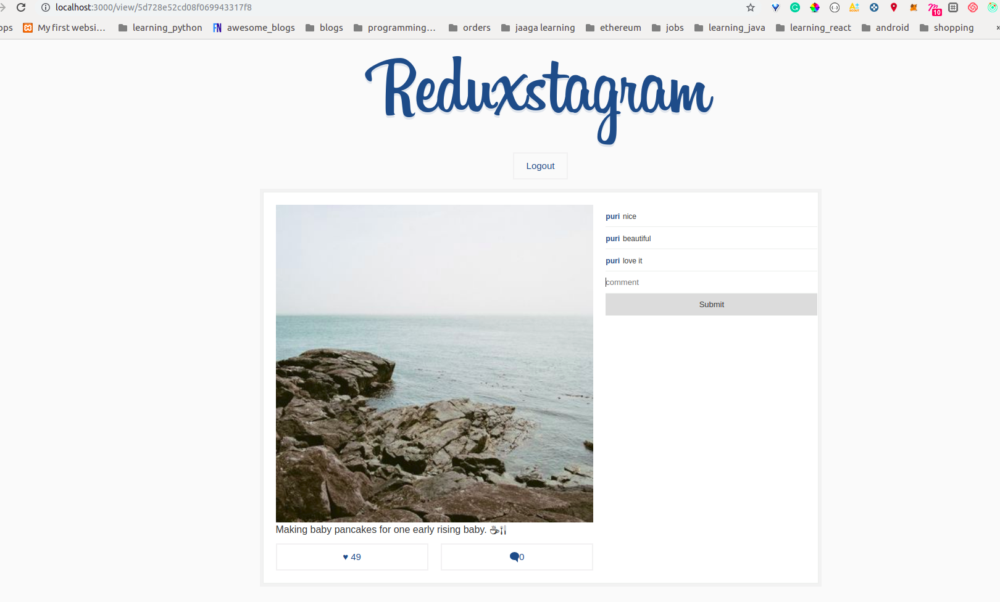
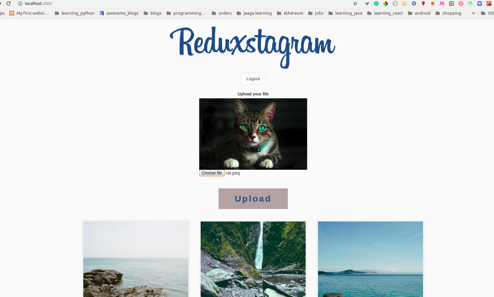

This project was bootstrapped with [Create React App](https://github.com/facebook/create-react-app)

**Image uploading app made with React, Redux, Redux-thunk, Node, Mongoose, Typescript. Used AWS S3 to store images.**

**Inspiration:**

This app is inspired from wesbos [redux tutorials](https://learnredux.com/) which was completely a frontend app made in React and Redux.

## Features:
- Sign-up & login
- Upload pics you love!
- Maintaing user session when user refreshes the page
- Share your post url to receive comments and likes ❤

### The Login Page

- On laptop


### The Registration Page

- On laptop



### The Home page



### Single Post upon clicking



### Image Preview before uploading



## Technologies used:

#### Client side
- [React](Create-React-App)
- Redux
- Typescript
- Axios


#### Server side
- Nodejs
- Typescript
- Mongoose
- Redis
- aws-sdk & multer-s3


#### Clound services
- Hosting - AWS
- Storing images - AWS S3


## Steps to install
In order to run the app in browser, you would first require to install NodeJS, Mongodb and Redis

- [NodeJS](https://nodejs.org/en/download/)
- [MongoDB](https://docs.mongodb.com/manual/administration/install-community)
- [Redis](https://redis.io/)

Next, install reduxgram-server and reduxtagram-client.

#### Reduxtagram-server
- `git clobe git@github.com:personal-pooya/reduxtagram-server.git`
- Run `npm install`
- Run `npm start`

Server will get started on port 4000.

#### Reduxtagram-client
- `git clone git@github.com:personal-pooya/reduxtagram-client.git`
- Run `npm install`
- Run `npm start`

This will start the client app on port 3000.


## Alternatively, you can also install it using docker
- Install docker
- Clone both the repos
- build the Images:

  For reduxtagram-client repo:
  - `docker build -t  my-reduxtagram-image .`
  
  For reduxtagram-server repo:
  - `docker build -t reduxtagram-server-image .`

Note: These images name should match `image` key inside docker-compose.yml file.

- Last, run `docker-compose up` from reduxtagram-server repo to run all the containers.


### For reduxtagram-server
For any bugs, improvements, or feature requests feel free to create an issue [here](https://github.com/personal-pooya/reduxtagram-server/issues/new) with expected result.

### For reduxragram-client
For any bugs, improvements, or feature requests feel free to create an issue [here](https://github.com/personal-pooya/reduxtagram-client/issues/new) with expected result.

### TroubleShooting:

In express, if you want user credentials in `req.session` object. Then one need to pass {withCredentials: true} while making API request through axios.

Ex:
```
axios.post(`${apiUrl}/images/upload-image`, imageFormObj, {
          headers: {
            'Accept-Language': 'en-Us,en; q=0.8',
            'Content-Type': `multipart/form-data`
          },
          withCredentials: true
        })
          .then((response) => {
            console.log(response.data)
          })
          .catch((err) => {
            console.log(err.response)
        }) 
```